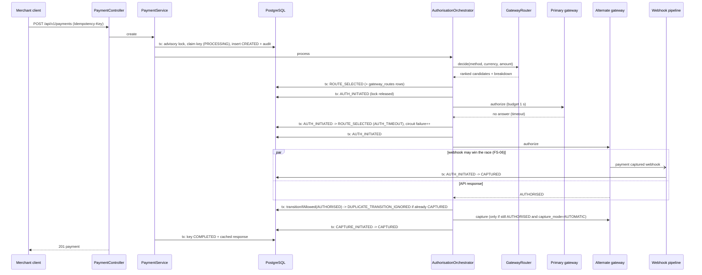

# Architecture

PayFlow is a single Spring Boot 3.3 service (Java 21, virtual threads) backed by PostgreSQL 15.
It routes payments across four simulated gateways (Razorpay, Stripe, PayU, UPI), fails over
within 2 seconds, keeps every request idempotent, ingests and reconciles webhooks, and writes an
immutable audit row for every state change.

## Packages

| Package | Responsibility |
|---|---|
| `domain` | `TransactionState` (transition table), `AuditEvent`, `PaymentMethod`, `HealthStatus`, `AttemptOutcome` |
| `entity`, `repository` | JPA mappings of the 19 tables; locking and bulk queries |
| `statemachine` | `TransactionStateMachine`, `AuditWriter`, `InvalidStateTransitionException` |
| `payment` | `PaymentService` (API facade + idempotency), `AuthorisationOrchestrator` (routing + failover + retry queue), `CaptureService`, `RefundService`, `AttemptRecorder` |
| `routing` | `GatewayRouter` (A3.2 score), `CircuitBreakerService` (A3.3), `GatewayMetricsService` (sliding window + A3.4 prior), `RoutingConfigService`, `GatewayConfigService` |
| `ratelimit` | `GatewayRateLimiter` (A8.4) |
| `gateway` | `PaymentGateway` interface, four adapters on `SimulatedGateway`, `MockGatewayLedger`, `MockControl` (B4.3), `GatewayCaller` (deadline + interruption), `GatewayRegistry` |
| `idempotency` | `IdempotencyService` (A4.1/A8.2) |
| `webhook` | `WebhookSignatureVerifier`, `WebhookPayloadParser`, `WebhookIngestionService`, `WebhookEventProcessor`, `WebhookQueueService` |
| `reconciliation` | `ReconciliationService` (A5.5 + settlement matching) |
| `jobs` | `MaintenanceService` (job logic), `ScheduledJobs` (Spring scheduling) |
| `db` | `DataSourceConfig` (Hikari, optional read replica), `DatabaseGuard` (internal circuit breaker, pool stats) |
| `tracing` | `TraceFilter`, `TraceContext` (A8.5) |
| `security`, `alert`, `notification` | security audit log, alert dispatch, notification outbox |
| `web` | controllers, filters (`ApiKeyFilter`, `MockControlFilter`, `DatabaseCircuitFilter`), `GlobalExceptionHandler` |
| `error` | `ApiException`, `ErrorMapper`, `ErrorResponse` (A7.2 format), `ErrorCatalog` (gateway error translation) |

## Payment request flow



Outcomes: `201` authorised/captured, `202` queued (UPI collect pending, or parked for async
retry with `notice.code = PAYMENT_QUEUED_FOR_RETRY`), `402` hard decline
(`PAYMENT_AUTH_FAILED` with translated gateway details), `422` no eligible gateway, `409`
idempotency conflict, `503` after max retries or when the database breaker is open.

### Failure matrix (A1.1)

| Gateway outcome | Handling |
|---|---|
| unreachable (`X-Mock-Gateway-Down`) | immediate failover, circuit failure++ |
| timeout | call abandoned at the attempt budget (virtual thread interrupted), `AUTH_INITIATED -> ROUTE_SELECTED`, circuit failure++ |
| 5xx | one retry on the same gateway after 100-150 ms if budget allows, then `AUTH_FAILED -> ROUTE_SELECTED` |
| 429 | rate limiter paused for `Retry-After` (+ backoff for Stripe); not a circuit failure |
| decline | no retry, no failover: `AUTH_FAILED -> FAILED`, customer notification |

If every candidate fails, is throttled or circuit-open, the payment is parked in
`ROUTE_SELECTED` with `next_retry_at` (exponential backoff with jitter, at least `Retry-After`) and
retried by the payment retry worker; after `payment-max-retries` (3) it becomes `FAILED` with
`MAX_RETRIES_EXCEEDED` and the customer is notified (C1.4, P1 "no silent failures").

## Webhook pipeline (A5.2)

```
POST /api/v1/webhooks/{gateway}   (raw bytes)
  1. Signature verification      WebhookSignatureVerifier, constant-time, over raw bytes
       fail -> 401 INVALID_SIGNATURE + security_audit_log row with source IP (FS-10)
  2. Parse                       WebhookPayloadParser: native Razorpay/Stripe/PayU/UPI shapes or a generic flat format
  3. Dedup + enqueue (one DB tx) INSERT ... ON CONFLICT DO NOTHING into processed_webhook_events;
                                 if new, INSERT webhook_queue row (PENDING)
       duplicate -> 200 {"status":"duplicate"} (FS-02)
  4. Event processor             inline fast path (unless the pool is under pressure), else queue worker
       one DB tx: lock queue row FOR UPDATE, C4.3 checks, state-machine transitions, mark COMPLETED
  5. Audit logger                rows written by the state machine (created_by = webhook_processor)
  6. Notification dispatcher     notification_outbox, sent by the dispatcher job
```

C4.3 checks before any transition: transaction id match, currency match, gateway reference match,
amount match (a smaller captured amount is only accepted while our own capture is in flight), and
status validity. A failed check returns `422 WEBHOOK_VERIFICATION_FAILED`, moves the item to the DLQ
and writes a `WEBHOOK_VERIFICATION_FAILED` security event.

Out-of-order events (e.g. settlement before capture) are deferred: `FAILED` with
`next_retry_at` = 2 s, 4 s, 8 s; after `max_retries` (3) the item goes to the DLQ and an alert is
raised. Events behind the current state are acknowledged as no-ops. `POST
/api/v1/admin/webhooks/dlq/{id}/replay` re-processes a DLQ item.

Atomicity: the dedup insert and the enqueue commit together, so an event is never acknowledged
without being stored. Processing is a separate transaction that is idempotent (queue row locked,
status checked, transitions validated), which reconciles A5.4's "insert + processing atomic" with
A5.2's persistent queue between them (see `docs/errors-found.md`).

A late success from a gateway the payment already failed over from is an orphan charge: an
`ORPHAN_GATEWAY_CHARGE` anomaly is raised and, after commit, the orphan authorisation is voided.

## Idempotency (A4.1, A8.2, FS-03/09/13)

In one transaction: `pg_advisory_xact_lock(hashtext('idem_' || merchant || ':' || key))`, read
`idempotency_keys` (PK `(merchant_id, key)`):

| Existing row | Result |
|---|---|
| none / expired | insert `PROCESSING`, create the transaction, proceed |
| `PROCESSING` | 409 `IDEMPOTENCY_CONFLICT` |
| `COMPLETED` | cached `response_code` + `response_body`, header `Idempotent-Replayed: true` |
| `FAILED` | take ownership again and resume the same transaction |
| different request hash | 422 `IDEMPOTENCY_KEY_REUSED` |

After processing, `complete()` stores the response (deterministic 4xx errors are cached too);
unexpected errors call `fail()` so the client can retry. Capture, void and refund accept an optional
`Idempotency-Key` with the same semantics. The gateway idempotency token is the transaction id, so a
retried call on the same gateway never creates a second charge (`MockGatewayLedger`). Expired keys are
deleted by the purge job.

## Reconciliation (A5.5)

1. Stale scan: transactions in `AUTH_INITIATED`, `CAPTURE_INITIATED`, `VOID_INITIATED`,
   `REFUND_INITIATED` not updated for `stale-threshold` (5 min).
2. Poll the gateway status API by reference (or by transaction id when no reference came back).
3. Apply the gateway status with `RECONCILIATION_OVERRIDE` audit events; unknown status is logged
   as `STALE_NO_GATEWAY_STATUS`.
4. Settlement: `CAPTURED`/`PARTIALLY_CAPTURED`/`SETTLED` payments from the last 7 days, keyset
   paged by id (1000), one settlement-report call per gateway per page. Confirmed payments move to
   `SETTLED` with `bulkTransition` (one UPDATE + batched audit inserts). `FAILED`/`REVERSED`
   payments move to `RECONCILIATION_MISMATCH`, get a `CRITICAL` `SETTLEMENT_MISMATCH` anomaly and an
   alert; no refund is ever issued automatically (FS-11).

Each run writes a `reconciliation_runs` summary and `reconciliation_log` rows;
`GET /api/v1/reconciliation/reports/{run_id}` returns both plus anomalies. Scans run in read-only
transactions, which go to the read replica when configured.

## Background jobs

| Job | Default schedule | Purpose |
|---|---|---|
| webhook queue worker | every 1 s | claims due items with `FOR UPDATE SKIP LOCKED`, processes, retries, DLQ |
| payment retry worker | every 1 s | claims parked payments (`next_retry_at` cleared under lock) and re-runs the orchestrator |
| reconciliation | every 15 min (first after 2 min) | A5.5 |
| UPI collect expiry | every 15 s | polls expired collects; `AUTH_EXPIRED` + notification, no retry (FS-12) |
| auth hold expiry | every 5 min | `AUTHORISED` past the gateway's hold period -> `AUTH_EXPIRED` |
| abandonment | every 5 min | `CREATED` older than 30 min -> `ABANDONED` |
| health metrics flush | second 5 of every minute | per-minute `gateway_health_metrics` row per gateway |
| idempotency purge | every 10 min | deletes expired keys |
| notification dispatcher | every 2 s | sends `notification_outbox` rows (logged) |

All jobs are safe on several instances: rows are claimed under locks and the state machine rejects
stale transitions. Jobs are disabled with `payflow.jobs.enabled=false` (tests).

## Data model

19 tables (`src/main/resources/db/migration/V1__core_schema.sql`, seed data in `V2__seed_reference_data.sql`,
DBML in `docs/schema.dbml`). The ten tables required by A6.1 use the brief's names:

| A6.1 table | Notes |
|---|---|
| `transactions` | current state, amounts in BIGINT paise, `trace_id`, hold/settlement fields; CHECKs on state, hold and refund totals |
| `transaction_state_log` | immutable audit trail (trigger) |
| `gateway_routes` | every candidate per routing decision with score, rank, `selected`, JSONB breakdown |
| `idempotency_keys` | PK `(merchant_id, key)`, cached response |
| `processed_webhook_events` | PK `(gateway, event_id)` |
| `gateway_health_metrics` | per-minute aggregates |
| `reconciliation_log` | per-transaction findings |
| `refunds` | `gateway_refund_id`, `state` |
| `gateway_config` | capabilities, fees, rate limits, hold/refund windows, signature scheme |
| `routing_config` | key/value weights and thresholds |

Additional: `webhook_queue` (queue + DLQ), `gateway_attempts`, `circuit_breaker_config`,
`circuit_breaker_state`, `gateway_historical_performance` (A3.4 dataset), `reconciliation_runs`,
`anomalies`, `security_audit_log` (immutable), `notification_outbox`.

Money is integer paise everywhere (A6.2); display strings (`"1200.00"`) are produced only at the API
boundary, and rupee strings in PayU/UPI webhooks are converted with `BigDecimal.movePointRight(2)`.

## Connection exhaustion and load (FS-14, C5)

- Hikari pool of 20 with `connection-timeout: 2000`: an exhausted pool fails fast instead of queueing.
- No connection is held during gateway calls (A8.1 pattern above).
- docker-compose puts PgBouncer (transaction pooling) between the app and PostgreSQL; the JDBC
  `prepareThreshold=0` setting is applied for it. Flyway uses a direct `PAYFLOW_FLYWAY_URL`
  because migrations take a session-level advisory lock.
- Optional read replica (`PAYFLOW_REPLICA_URL`): `DataSourceConfig` wraps an
  `AbstractRoutingDataSource` in a `LazyConnectionDataSourceProxy`; read-only transactions
  (reconciliation scans) go to the replica.
- `DatabaseGuard`: after 5 consecutive connection-acquisition failures the breaker opens for 5 s;
  `DatabaseCircuitFilter` answers `503 SERVICE_UNAVAILABLE` with `Retry-After: 2` meanwhile; one
  probe request closes it. `/api/v1/health` stays available. Pool stats: `GET /api/v1/admin/db-pool`.
- Webhook backpressure: when the pool is ≥80% busy or threads are waiting, ingestion stores the
  event and returns `queued` without processing inline.
- Logging is asynchronous (logback `AsyncAppender`, `neverBlock`), and security-log writes never fail
  a request, so a struggling database cannot cause a recursive logging failure (C5.3).

## Tracing (A8.5)

`TraceFilter` assigns a UUID v4 `trace_id` per request (or accepts `X-Trace-Id`) and a `request_id`,
puts them and the client IP in the MDC, and returns both as response headers. The trace id is stored
on `transactions.trace_id`, copied into every audit row's `metadata`, sent to gateways as
`X-Trace-Id` (visible in `gateway_response._request_headers`), and restored from the transaction when
a webhook or job processes it. Logs are JSON (logstash encoder) with MDC fields at top level; the
router logs `component=gateway_router action=route_selected gateway score duration_ms`.

## Security

- Merchant APIs require `X-API-Key` (or `Authorization: Bearer`); failures are logged to
  `security_audit_log` (`API_KEY_INVALID`). `X-Merchant-Id` scopes payments and idempotency keys.
- Webhooks: per-gateway signatures (HMAC-SHA256, Stripe-Signature with 5-minute timestamp
  tolerance, HMAC-SHA512, RSA SHA256 for NPCI), constant-time comparison.
- Input validation on all DTOs; all errors use the A7.2 format with `request_id` and `trace_id`.
- PII is redacted before anything reaches the audit trail.

## Case studies (Part C)

| Case | What prevents it here |
|---|---|
| C1 Diwali double charge | idempotency keys at API and gateway level; circuit breaker; backoff; async retry queue for parked payments |
| C2 silent settlement leak | settlement reconciliation every run; reversal/failure webhooks move captured payments to `RECONCILIATION_MISMATCH` with anomaly + alert; `settlement_batch_id` tracked |
| C3 UPI mandate exploitation | collect flow stays `AUTH_INITIATED` (202) until approval; expiry job moves it to `AUTH_EXPIRED` after 5 min; merchants should fulfil only on `CAPTURED` |
| C4 webhook replay fraud | signature over raw bytes, then amount / reference / currency / transaction-id checks, dedup by event id |
| C5 connection stampede | short transactions, fail-fast pool, DB circuit breaker, PgBouncer, async logging, webhook backpressure |

## Failure scenarios

| FS | Implementation | Test (`FailureScenarioTest`) |
|---|---|---|
| FS-01 timeout failover | `GatewayCaller` deadline, `AUTH_INITIATED -> ROUTE_SELECTED`, circuit failure | `fs01_timeoutFailsOver` |
| FS-02 duplicate webhook | `processed_webhook_events` insert-if-absent | `fs02_duplicateWebhook` |
| FS-03 double submit | idempotency `PROCESSING` -> 409 | `fs03_doubleSubmit` |
| FS-04 capture 5xx | 1/2/4 × backoff retries, `CAPTURE_FAILED`, status poll late success | `fs04_captureServerError`, `fs04_lateSuccess` |
| FS-05 partial capture | `PARTIALLY_CAPTURED`, `remaining_hold_paise`, remainder capture or `REMAINING_HOLD_RELEASED` | `fs05_partialCaptureThenRemainder`, `fs05_partialCaptureThenVoidRemainder` |
| FS-06 webhook before API | webhook `AUTH_INITIATED -> CAPTURED`; API uses `transitionIfAllowed` | `fs06_webhookBeforeApiResponse` |
| FS-07 cascade | circuit OPEN exclusion, DEGRADED health, 429 + Retry-After, parking and async retry | `fs07_cascadeFailure` |
| FS-08 refund settled | `SETTLED -> REFUND_INITIATED -> REFUNDED` | `fs08_refundSettled` |
| FS-09 concurrent race | advisory xact lock + composite PK | `fs09_concurrentRace` |
| FS-10 replay attack | signature verification, 401, security log with IP | `fs10_replayAttack` |
| FS-11 missing settlement | settlement reconciliation, anomalies, alert, no refund | `fs11_reconciliationMismatch` |
| FS-12 UPI collect timeout | expiry job / EXPIRED callback -> `AUTH_EXPIRED`, notification, no retry | `fs12_upiCollectTimeoutPolled`, `fs12_upiCallbackExpired` |
| FS-13 key collision | PK `(merchant_id, key)` | `fs13_merchantScopedKeys` |
| FS-14 pool exhaustion | `DatabaseGuard` + filter, burst integrity | `fs14_databaseCircuitBreaker`, `fs14_burst` |
| FS-15 corruption attempt | `InvalidStateTransitionException`, `REJECTED_TRANSITION` | `fs15_corruptionAttempt` |
