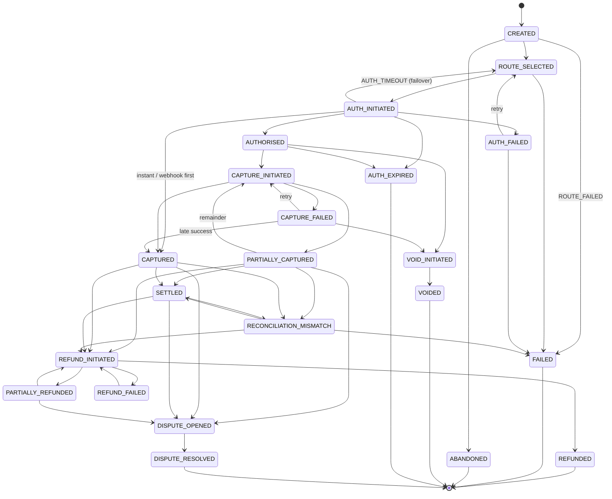

# Transaction State Machine

Source of truth: `src/main/java/com/payflow/domain/TransactionState.java` (transition table) and
`src/main/java/com/payflow/statemachine/TransactionStateMachine.java` (the only code that writes
`transactions.state`). The database also enforces the set of legal state names with a `CHECK`
constraint on `transactions.state`.

## States (22)

| # | State | Mandatory (A2.2)? | Meaning |
|---|---|---|---|
| 1 | `CREATED` | yes | Row created, no gateway interaction yet |
| 2 | `ROUTE_SELECTED` | yes | Router picked a gateway; also the "parked for asynchronous retry" state (`next_retry_at` set) |
| 3 | `AUTH_INITIATED` | yes | Authorisation request sent; for UPI collect, waiting for customer approval |
| 4 | `AUTHORISED` | yes | Hold placed on the customer's instrument |
| 5 | `AUTH_FAILED` | yes | Gateway declined or errored |
| 6 | `CAPTURE_INITIATED` | yes | Capture request sent |
| 7 | `CAPTURED` | yes | Full authorised amount captured |
| 8 | `PARTIALLY_CAPTURED` | yes | Part of the hold captured; `remaining_hold_paise` still available |
| 9 | `CAPTURE_FAILED` | yes | Capture failed after retries; hold still exists |
| 10 | `REFUND_INITIATED` | yes | Refund request sent |
| 11 | `REFUNDED` | yes (terminal) | Everything captured has been refunded |
| 12 | `FAILED` | yes (terminal) | Hard decline, no eligible gateway, or max retries exceeded |
| 13 | `ABANDONED` | additional (terminal) | `CREATED` and never routed for `payflow.jobs.abandon-after` (30 min) |
| 14 | `VOID_INITIATED` | additional | Void (hold release) request sent |
| 15 | `VOIDED` | additional (terminal) | Hold released, nothing captured |
| 16 | `AUTH_EXPIRED` | additional (terminal) | Hold period elapsed (A1.2) or UPI collect window elapsed (FS-12) |
| 17 | `SETTLED` | additional | Gateway settlement report / webhook confirmed the funds (C2.4) |
| 18 | `PARTIALLY_REFUNDED` | additional | Some, not all, captured money refunded |
| 19 | `REFUND_FAILED` | additional | Refund call failed; refund can be retried |
| 20 | `DISPUTE_OPENED` | additional | Chargeback opened (webhook) |
| 21 | `DISPUTE_RESOLVED` | additional (terminal) | Chargeback closed |
| 22 | `RECONCILIATION_MISMATCH` | additional | Gateway says a captured/settled payment failed or was reversed (FS-11); parked for human review |

### Why the additional states exist

- `ABANDONED` – distinguishes a client that dropped off from a gateway failure, so success-rate
  analytics are not polluted and the row does not stay `CREATED` forever.
- `VOID_INITIATED` / `VOIDED` – the void is a gateway call that can fail; an intermediate state
  lets reconciliation pick up a void that never completed (it scans `VOID_INITIATED`).
- `AUTH_EXPIRED` – required by A1.2 (hold released by the gateway) and FS-12 (UPI collect expiry).
  It is separate from `FAILED` because no decline happened and no money was ever held/captured.
- `SETTLED` – C2.4 requires settlement tracking; `settled_at` and `settlement_batch_id` are set
  when entering it.
- `PARTIALLY_REFUNDED` / `REFUND_FAILED` – listed in A2.2 as outgoing events of
  `REFUND_INITIATED`; they need to be states so that a second partial refund or a retry is legal.
- `DISPUTE_OPENED` / `DISPUTE_RESOLVED` – C2.3 notes that `dispute.created` must be consumed;
  modelling it prevents a refund being issued on top of a chargeback.
- `RECONCILIATION_MISMATCH` – FS-11 explicitly says transactions are flagged with this name. It
  is not terminal: after review an operator outcome can be `SETTLED`, `REFUND_INITIATED` or
  `FAILED`.

## Transition table

Events are the values written to `transaction_state_log.event` (constants in
`domain/AuditEvent.java`).

| From | To | Event(s) | Triggered by |
|---|---|---|---|
| (none) | `CREATED` | `PAYMENT_CREATED` | `PaymentService.create` |
| `CREATED` | `ROUTE_SELECTED` | `ROUTE_SELECTED`, `PAYMENT_QUEUED_FOR_RETRY` | orchestrator |
| `CREATED` | `ABANDONED` | `ABANDONED` | abandonment job |
| `CREATED` | `FAILED` | `ROUTE_FAILED` | no gateway supports method/currency |
| `ROUTE_SELECTED` | `AUTH_INITIATED` | `GATEWAY_AUTH_REQUESTED` | orchestrator, before the gateway call |
| `ROUTE_SELECTED` | `FAILED` | `ROUTE_FAILED`, `MAX_RETRIES_EXCEEDED` | parked payment out of options |
| `AUTH_INITIATED` | `AUTHORISED` | `GATEWAY_AUTH_SUCCESS`, `RECONCILIATION_OVERRIDE` | gateway response, webhook, reconciliation |
| `AUTH_INITIATED` | `AUTH_FAILED` | `GATEWAY_AUTH_DECLINED`, `GATEWAY_FAILOVER`, `AUTH_TIMEOUT`, `RECONCILIATION_OVERRIDE` | gateway response/webhook |
| `AUTH_INITIATED` | `AUTH_EXPIRED` | `AUTH_HOLD_EXPIRED`, `RECONCILIATION_OVERRIDE` | UPI collect expiry job / callback |
| `AUTH_INITIATED` | `ROUTE_SELECTED` | `AUTH_TIMEOUT`, `PAYMENT_QUEUED_FOR_RETRY` | timeout failover (FS-01) |
| `AUTH_INITIATED` | `CAPTURED` | `GATEWAY_CAPTURE_SUCCESS`, `RECONCILIATION_OVERRIDE` | instant UPI approval, capture webhook before API response (FS-06) |
| `AUTHORISED` | `CAPTURE_INITIATED` | `MERCHANT_CAPTURE_REQUESTED`, `GATEWAY_CAPTURE_SUCCESS` | auto/manual capture, capture webhook |
| `AUTHORISED` | `VOID_INITIATED` | `VOID_REQUESTED`, `GATEWAY_VOID_SUCCESS` | `POST /void`, void webhook |
| `AUTHORISED` | `AUTH_EXPIRED` | `AUTH_HOLD_EXPIRED` | auth-hold expiry job, expiry webhook |
| `AUTH_FAILED` | `ROUTE_SELECTED` | `GATEWAY_FAILOVER`, `PAYMENT_QUEUED_FOR_RETRY` | 5xx/429 failover, parking |
| `AUTH_FAILED` | `FAILED` | `GATEWAY_AUTH_DECLINED`, `MAX_RETRIES_EXCEEDED` | hard decline / retries exhausted |
| `CAPTURE_INITIATED` | `CAPTURED` | `GATEWAY_CAPTURE_SUCCESS` | capture response/webhook |
| `CAPTURE_INITIATED` | `PARTIALLY_CAPTURED` | `GATEWAY_PARTIAL_CAPTURE` | partial capture (FS-05) |
| `CAPTURE_INITIATED` | `CAPTURE_FAILED` | `GATEWAY_CAPTURE_ERROR`, `RECONCILIATION_OVERRIDE` | retries exhausted (FS-04) |
| `CAPTURED` | `REFUND_INITIATED` | `REFUND_REQUESTED` | `POST /refund`, dashboard refund webhook |
| `CAPTURED` | `SETTLED` | `SETTLEMENT_CONFIRMED` | reconciliation, settlement webhook |
| `CAPTURED` | `DISPUTE_OPENED` | `DISPUTE_OPENED` | webhook |
| `CAPTURED` | `RECONCILIATION_MISMATCH` | `RECONCILIATION_MISMATCH` | reconciliation / reversal webhook |
| `PARTIALLY_CAPTURED` | `CAPTURE_INITIATED` | `MERCHANT_CAPTURE_REQUESTED` | capture the remainder |
| `PARTIALLY_CAPTURED` | `REFUND_INITIATED`, `SETTLED`, `DISPUTE_OPENED`, `RECONCILIATION_MISMATCH` | as for `CAPTURED` | |
| `CAPTURE_FAILED` | `CAPTURE_INITIATED` | `MERCHANT_CAPTURE_REQUESTED` | merchant retries capture |
| `CAPTURE_FAILED` | `VOID_INITIATED` | `VOID_REQUESTED` | merchant gives up and voids |
| `CAPTURE_FAILED` | `CAPTURED` | `LATE_CAPTURE_SUCCESS`, `GATEWAY_CAPTURE_SUCCESS` | status poll finds the capture happened (FS-04) |
| `VOID_INITIATED` | `VOIDED` | `GATEWAY_VOID_SUCCESS`, `RECONCILIATION_OVERRIDE` | void response / reconciliation |
| `SETTLED` | `REFUND_INITIATED` | `REFUND_REQUESTED` | refund after settlement (FS-08) |
| `SETTLED` | `DISPUTE_OPENED`, `RECONCILIATION_MISMATCH` | as above | |
| `REFUND_INITIATED` | `REFUNDED` / `PARTIALLY_REFUNDED` | `GATEWAY_REFUND_SUCCESS`, `RECONCILIATION_OVERRIDE` | refund response/webhook |
| `REFUND_INITIATED` | `REFUND_FAILED` | `GATEWAY_REFUND_FAILED` | refund error |
| `PARTIALLY_REFUNDED` | `REFUND_INITIATED` | `REFUND_REQUESTED` | further partial refund |
| `PARTIALLY_REFUNDED` | `DISPUTE_OPENED` | `DISPUTE_OPENED` | webhook |
| `REFUND_FAILED` | `REFUND_INITIATED` | `REFUND_REQUESTED` | retry refund |
| `DISPUTE_OPENED` | `DISPUTE_RESOLVED` | `DISPUTE_RESOLVED` | webhook |
| `RECONCILIATION_MISMATCH` | `SETTLED`, `REFUND_INITIATED`, `FAILED` | operator: `POST /api/v1/admin/anomalies/{id}/resolve?resolution=SETTLED or WRITE_OFF`, or `POST /payments/{id}/refund` | human review (FS-11); never automatic |

Terminal states (no outgoing transitions): `REFUNDED`, `FAILED`, `ABANDONED`, `VOIDED`,
`AUTH_EXPIRED`, `DISPUTE_RESOLVED`.

### Deviations from the brief's A2.2 table, and why

| Transition | Reason |
|---|---|
| `AUTH_INITIATED -> ROUTE_SELECTED` | FS-01 states this exact path for timeout failover; the A2.2 table lists only `AUTH_TIMEOUT` as an outgoing event. A timeout's outcome is unknown, so we do not claim `AUTH_FAILED`. |
| `AUTH_INITIATED -> CAPTURED` | FS-06: Stripe `payment_intent.succeeded` (and UPI approval, which has no separate capture per A1.3) arrive while the API call is pending. |
| `CAPTURE_FAILED -> CAPTURED` | FS-04 late-success pattern: after `CAPTURE_FAILED` the status API is polled and may show the capture went through. |
| `SETTLED -> REFUND_INITIATED` | FS-08 requires it; A2.1 says refunds only from `CAPTURED`/`PARTIALLY_CAPTURED` (see `docs/errors-found.md`). |
| `CREATED -> FAILED` | `ROUTE_FAILED` with no eligible gateway at all (e.g. UPI in USD); passing through `ROUTE_SELECTED` would claim a route was chosen. |
| `* -> RECONCILIATION_MISMATCH` | FS-11 naming; automatic refunds are never triggered from it. |
| Release of the remaining hold after a partial capture | Not a state change. `POST /void` on a `PARTIALLY_CAPTURED` payment calls the gateway void and records `REMAINING_HOLD_RELEASED` with `released_paise`; the state stays `PARTIALLY_CAPTURED` (A2.2 lists no `VOID_INITIATED` from `PARTIALLY_CAPTURED`), and the captured part can still be settled or refunded. |

## Diagram

## How transitions are applied

`TransactionStateMachine` offers:

- `transition(id, target, audit)` – validates, applies, audits; otherwise throws
  `InvalidStateTransitionException` whose message lists the valid targets
  (e.g. `Valid transitions from CREATED: [ABANDONED, FAILED, ROUTE_SELECTED]`). The API maps it to
  HTTP 409 `INVALID_STATE_TRANSITION` with `valid_transitions` in `details` (FS-15).
- `transitionIfAllowed(id, target, audit)` – used where another actor may legitimately have moved
  the state first (webhook vs. API response, FS-06). If not valid, it writes a
  `DUPLICATE_TRANSITION_IGNORED` audit row and returns empty; no exception, no double processing.
- `record(id, audit)` – audited event without a state change (`to_state = from_state`), e.g.
  `REMAINING_HOLD_RELEASED`, `CAPTURE_RETRY`, `UPI_COLLECT_INITIATED`.
- `bulkTransition(ids, from, to, audit, batchId)` – set-based `UPDATE ... WHERE state = :from
  RETURNING id` plus batched audit inserts, used by settlement reconciliation. It still checks the
  transition table first.

### Locking (A8.1)

Each call runs in a short transaction:
`SELECT id FROM transactions WHERE id = ? FOR NO KEY UPDATE` → `refresh` the entity → validate →
apply field updates and state → `flush` (so DB constraints such as
`captured_paise + released_paise <= amount_paise` fail before the audit row is written) → insert
audit row → commit. No lock is held while a gateway is called: the orchestrator commits
`AUTH_INITIATED`, calls the gateway outside any transaction, then opens a new transaction for the
result.

`FOR NO KEY UPDATE` is used instead of `FOR UPDATE` because the audit table has a foreign key to
`transactions`; the FK check takes `KEY SHARE`, which `FOR UPDATE` would block. That matters for
rejected transitions (next section). See ADR-003.

### Rejected transitions (FS-15)

`AuditWriter.writeRejected` runs with `Propagation.REQUIRES_NEW`, so the `REJECTED_TRANSITION` row
(`from_state` = current, `to_state` = attempted target, `metadata.valid_transitions`,
`metadata.attempted_event`, `created_by` = caller) commits even though the caller's transaction
rolls back when the exception propagates.

## Audit trail (A2.3)

Table `transaction_state_log`:

| Column | Type | Content |
|---|---|---|
| `id` | UUID PK | |
| `transaction_id` | UUID FK | |
| `from_state` | VARCHAR(32) | null only for the creation row |
| `to_state` | VARCHAR(32) | |
| `event` | VARCHAR(100) | `AuditEvent` constant |
| `gateway_reference` | VARCHAR(255) | |
| `gateway_response` | JSONB | gateway payload after `PiiSanitizer.sanitize` |
| `metadata` | JSONB | `trace_id`, `request_id`, `ip`, `user_agent`, plus amount snapshot (`amount_paise`, `captured_paise`, `remaining_hold_paise`, `refunded_paise`, `gateway`) and event-specific fields |
| `created_at` | TIMESTAMPTZ | strictly increasing per JVM (microsecond steps) so timelines order deterministically |
| `created_by` | VARCHAR(100) | `api:<merchant>`, `orchestrator`, `gateway:<name>`, `webhook_processor`, `reconciliation_engine`, job names |

Immutability: the entity is `@Immutable`, and the migration installs trigger
`trg_tsl_immutable` (function `forbid_audit_mutation`) that raises on any `UPDATE` or `DELETE`.
`security_audit_log` has the same trigger. Tested in `StateMachineAuditTest`.

PII: `PiiSanitizer.sanitize(Map)` replaces values of sensitive keys (`card_number`, `cvv`, `vpa`,
`email`, `contact`, …) with `[REDACTED]` and regex-redacts card numbers, CVVs, UPI handles, e-mails,
phone and account numbers inside strings, recursively.
